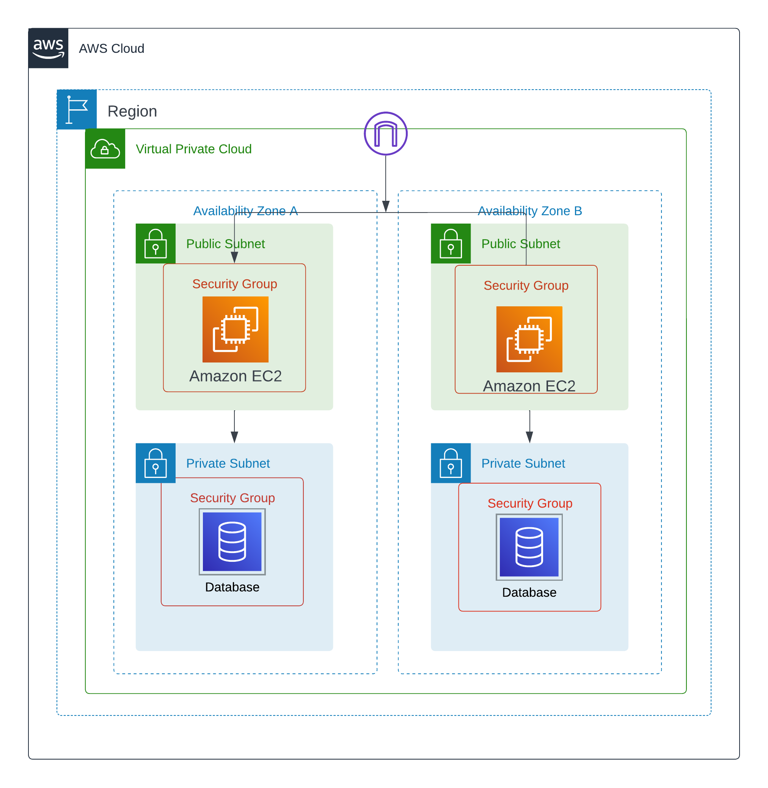

<h1 align="left">Infrastructure as Code (IaC) with Terraform</h1>

This repository contains Terraform configuration scripts to deploy a sample AWS infrastructure, including a Virtual Private Cloud (VPC), EC2 instances, RDS database instances, and associated networking components.

<h2>Architecture Overview</h2>

<h2>Components</h2>

<h3>VPC (Virtual Private Cloud)</h3>
<ul>
    <li>Creates an AWS VPC with specified CIDR block.</li>
    <li>Enables DNS hostnames and support.</li>
</ul>

<h3>EC2 Subnets</h3>
<ul>
    <li>Defines public and private subnets within the VPC across multiple availability zones.</li>
    <li>Enables mapping of public IP addresses for instances in public subnets.</li>
</ul>

<h3>Internet Gateway</h3>
<ul>
    <li>Attaches an internet gateway to the VPC for internet connectivity.</li>
</ul>

<h3>Route Table and Routes</h3>
<ul>
    <li>Sets up a route table with a default route pointing to the internet gateway.</li>
    <li>Associates the route table with public subnets to enable outbound internet access.</li>
</ul>

<h3>Security Groups</h3>
<ul>
    <li>Establishes security groups to control inbound and outbound traffic for EC2 instances and RDS instances.</li>
</ul>

<h3>Key Pair</h3>
<ul>
    <li>Creates an SSH key pair for EC2 instance authentication.</li>
</ul>

<h3>EC2 Instances</h3>
<ul>
    <li>Deploys EC2 instances within the public and private subnets, each with a specified instance type, security group, and user data script.</li>
    <li>Configures SSH access to the instances using local-exec provisioners.</li>
</ul>

<h3>RDS Instances</h3>
<ul>
    <li>Launches RDS (Relational Database Service) instances for MySQL databases within private subnets.</li>
    <li>Configures security group and subnet group for RDS instances.</li>
</ul>

<h2>Usage</h2>
<ol>
    <li><strong>Prerequisites</strong>
        <ul>
            <li>Install Terraform.</li>
            <li>Configure AWS credentials.</li>
        </ul>
    </li>
    <li><strong>Deployment</strong>
        <ol>
            <li>Clone this repository.</li>
            <li>Navigate to the repository directory.</li>
            <li>Run <code>terraform init</code> to initialize the working directory.</li>
            <li>Run <code>terraform apply</code> to create the infrastructure on AWS.</li>
        </ol>
    </li>
    <li><strong>Accessing Resources</strong>
        <ul>
            <li>Once deployed, access EC2 instances via SSH using the generated key pair.</li>
            <li>Connect to RDS instances using the specified credentials.</li>
        </ul>
    </li>
</ol>

<h2>Author</h2>

This Terraform configuration is maintained by [Your Name].

Feel free to customize and extend this setup based on your requirements.

For detailed documentation on Terraform, refer to the <a href="https://learn.hashicorp.com/tutorials/terraform/aws-build">Terraform Documentation</a>.

<em>Note: Ensure that you review all configurations and adjust as needed for security and compliance.</em>

